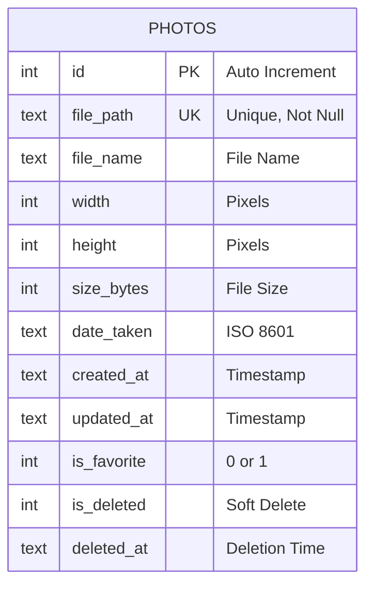
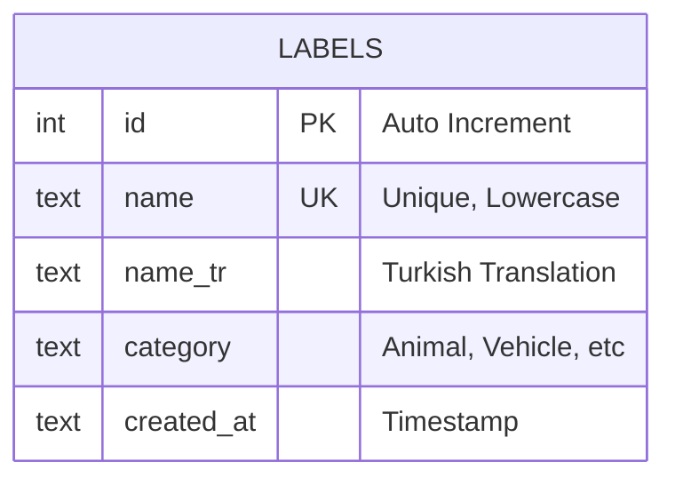
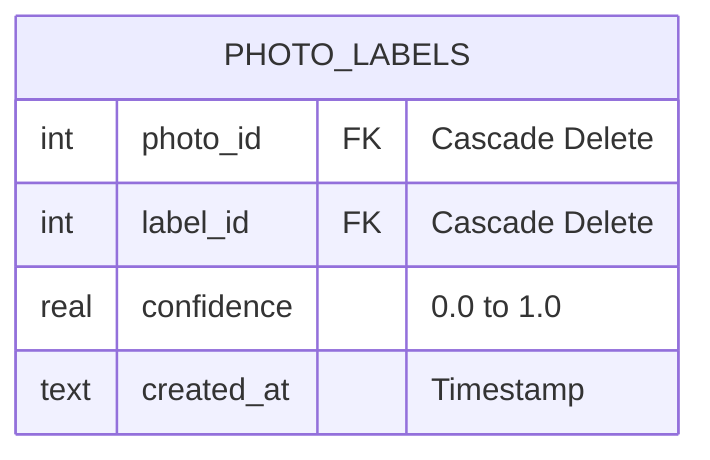
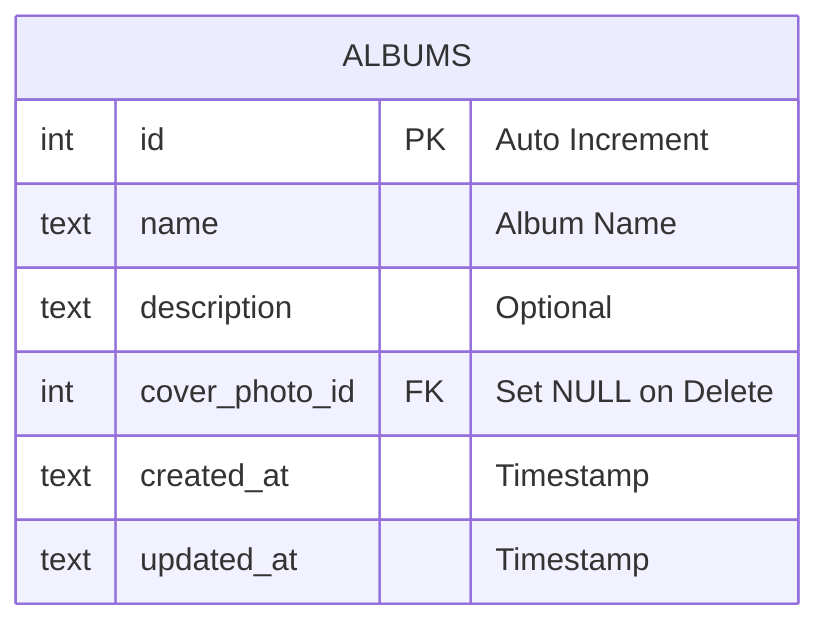
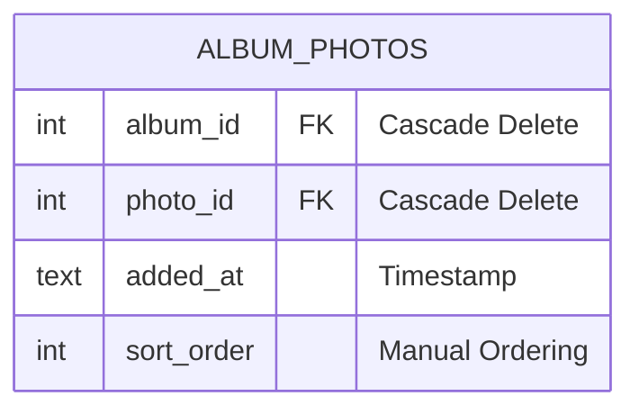
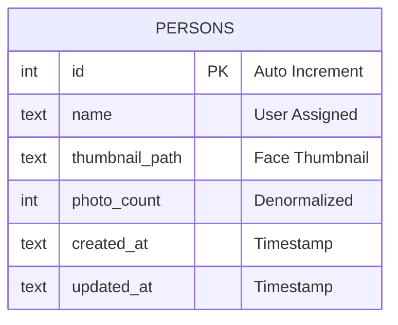
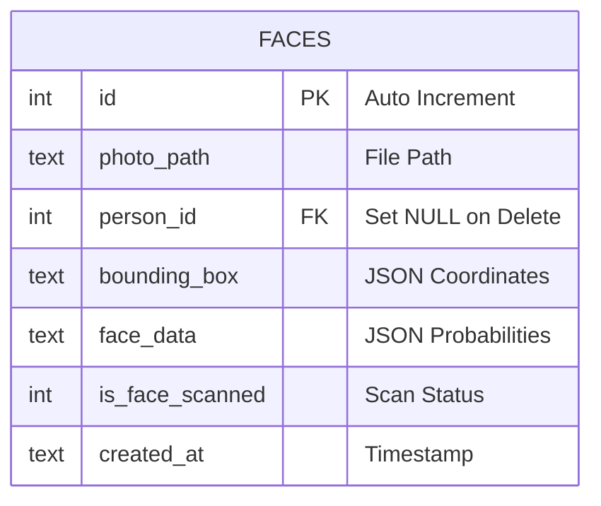

# VERİTABANI TABLO DİYAGRAMLARI

## 4.3.1. Photos Tablosu

**İndeksler:**
- `idx_photos_date` - Tarihe göre azalan sıralama
- `idx_photos_favorite` - Favori durumuna göre
- `idx_photos_deleted` - Silinme durumuna göre

---

## 4.3.2. Labels Tablosu

**İndeksler:**
- `idx_labels_name` - İngilizce isim
- `idx_labels_name_tr` - Türkçe isim

---

## 4.3.3. Photo_labels Tablosu

**Birincil Anahtar:** (photo_id, label_id) - Bileşik Anahtar

**İndeksler:**
- `idx_photo_labels_photo` - Fotoğraf kimliği
- `idx_photo_labels_label` - Etiket kimliği

---

## 4.3.4. Albums Tablosu

---

## 4.3.5. Album_photos Tablosu

**Birincil Anahtar:** (album_id, photo_id) - Bileşik Anahtar

**İndeksler:**
- `idx_album_photos_album` - Albüm kimliği

---

## 4.3.6. Persons Tablosu

---

## 4.3.7. Faces Tablosu

**İndeksler:**
- `idx_faces_photo` - Fotoğraf yolu
- `idx_faces_person` - Kişi kimliği

---

## Genel ER Diyagramı

Aşağıdaki diyagram tüm tabloları ve aralarındaki ilişkileri göstermektedir:

